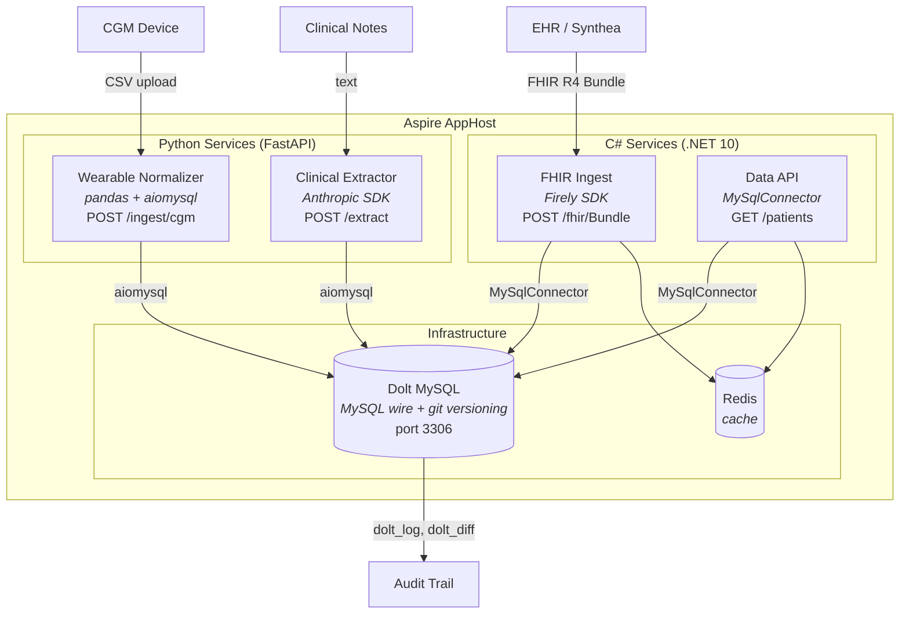

# ACME Health Platform

> **Demo / Research Project** -- Architecture exploration for a health data platform.
> Not production code. No real patient data. See [ADRs](docs/adr/) for design rationale.

A polyglot health data platform that ingests FHIR R4 records, wearable device streams, and clinical notes into a version-controlled database (Dolt MySQL). .NET Aspire orchestrates C# and Python services -- type-safe FHIR parsing where clinical data correctness matters, Python where the AI/ML ecosystem is strongest.

## Architecture



## Technology Choices

| Component | Language | Why |
|-----------|----------|-----|
| FHIR ingestion | C# (Firely SDK) | FHIR R4 has nested resource types where a wrong field type can mean a wrong medication dose. The compiler catches these. |
| Data API | C# (ASP.NET Core) | Shares the `Acme.Stack.Core` domain model with FHIR ingestion. One canonical patient type across both services. |
| Wearable normalizer | Python (FastAPI) | Health data libraries (HealthKit parsers, pandas for CGM analysis) are Python-native. |
| Clinical extractor | Python (FastAPI) | LLM SDKs (Anthropic, OpenAI), NLP libraries (spaCy), structured output parsing — Python's AI/ML ecosystem is stronger. |
| Database | Dolt MySQL | MySQL wire-compatible + git-style versioning. HIPAA audit trails at the storage layer, not in application code. See [ADR-1001](docs/adr/1001-doltgresql-versioned-clinical-data.md). |
| Orchestration | .NET Aspire | Service discovery, health checks, OpenTelemetry tracing across C# and Python services. One command starts everything. |

Full rationale in [ADR-2001](docs/adr/2001-polyglot-aspire-orchestration.md).

**A note on technology selection**: This demo uses C# where type safety is a clinical safety mechanism and Python where the ecosystem is strongest. In a production context, the technology mix depends on the existing codebase, team skills, and migration cost — not preference. Dolt MySQL's MySQL wire compatibility means every service connects with standard drivers (MySqlConnector, aiomysql). Switching to plain MySQL is a connection string change.

## Prerequisites

- .NET 10 SDK
- Python 3.13+ with [uv](https://docs.astral.sh/uv/)
- Docker Desktop (for Dolt MySQL and Redis containers)

## Quick Start

```bash
# One-time setup: configure the Dolt database password via User Secrets
dotnet user-secrets set Parameters:dolt-password doltpass --project src/AppHost

# Start the full platform (Aspire dashboard at https://localhost:15888)
dotnet run --project src/AppHost

# Or run individual services
dotnet run --project src/Acme.Stack.FhirIngest
cd src/services/wearable-normalizer && uv run fastapi dev
```

## Project Structure

```
acme-health/
  AcmeHealth.slnx                        .NET solution (slnx format)
  src/
    AppHost/                              Aspire orchestrator
    Acme.Stack.Core/                      Shared domain models (FHIR types, audit contracts)
    Acme.Stack.FhirIngest/                FHIR R4 ingestion service
    Acme.Stack.DataApi/                   Unified patient data API
    Acme.Stack.ServiceDefaults/           Shared Aspire config (OTel, health checks)
    services/
      wearable-normalizer/                Python — CGM, heart rate, activity
      clinical-extractor/                 Python — LLM entity extraction
  tools/
    schema-migrate/                       AI-assisted EHR schema mapping (planned)
  docs/
    adr/                                  Architecture decision records
  data/                                   Sample datasets (see data/README.md)
```

## Sample Data

| Dataset | Patients | Source |
|---------|----------|--------|
| Synthea FHIR R4 | 1,000 | [synthea.mitre.org](https://synthea.mitre.org/downloads) |
| MTSamples | 4,999 notes | [Kaggle (CC0)](https://www.kaggle.com/datasets/tboyle10/medicaltranscriptions) |
| GlucoBench CGM | ~479 | [GitHub](https://github.com/IrinaStatsLab/GlucoBench) |

```bash
bash data/scripts/download-samples.sh
```

## Architecture Decision Records

| ADR | Decision |
|-----|----------|
| [ADR-2001](docs/adr/2001-polyglot-aspire-orchestration.md) | C# + Python with Aspire orchestration |
| [ADR-2002](docs/adr/2002-fhir-canonical-data-model.md) | FHIR R4 as canonical data model with extensions |
| [ADR-2003](docs/adr/2003-monorepo-project-structure.md) | Monorepo with Aspire composition |
| [ADR-2004](docs/adr/2004-human-in-the-loop-clinical-ai.md) | Human review for AI-derived clinical data |
| [ADR-1001](docs/adr/1001-doltgresql-versioned-clinical-data.md) | Dolt for version-controlled clinical data (superseded: DoltgreSQL → Dolt MySQL) |

## License

MIT
