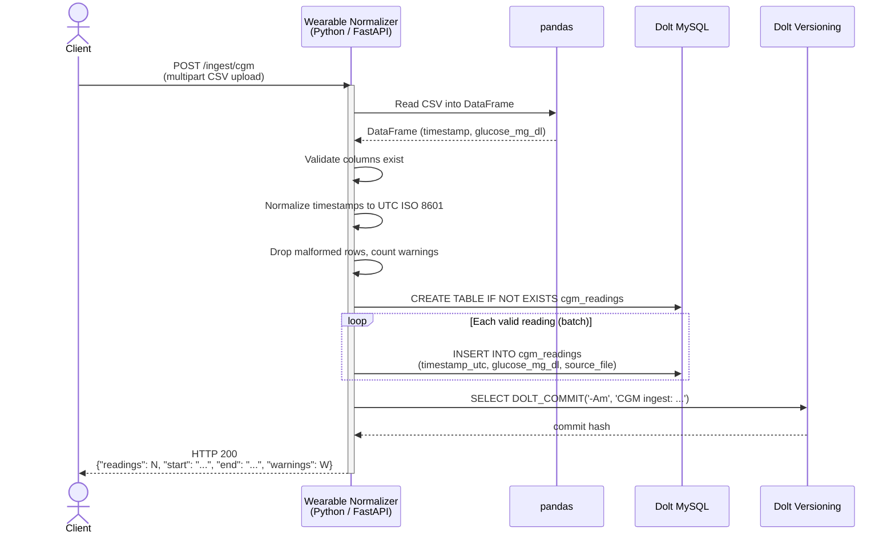

# CGM Ingest Sequence

Data flow when a CGM (Continuous Glucose Monitor) CSV file is ingested.

```mermaid
sequenceDiagram
    actor Client
    participant WN as Wearable Normalizer<br/>(Python / FastAPI)
    participant PD as pandas
    participant DB as Dolt MySQL
    participant Dolt as Dolt Versioning

    Client->>WN: POST /ingest/cgm<br/>(multipart CSV upload)
    activate WN

    WN->>PD: Read CSV into DataFrame
    PD-->>WN: DataFrame (timestamp, glucose_mg_dl)

    WN->>WN: Validate columns exist
    WN->>WN: Normalize timestamps to UTC ISO 8601
    WN->>WN: Drop malformed rows, count warnings

    WN->>DB: CREATE TABLE IF NOT EXISTS cgm_readings

    loop Each valid reading (batch)
        WN->>DB: INSERT INTO cgm_readings<br/>(timestamp_utc, glucose_mg_dl, source_file)
    end

    WN->>Dolt: SELECT DOLT_COMMIT('-Am', 'CGM ingest: ...')
    Dolt-->>WN: commit hash

    WN-->>Client: HTTP 200<br/>{"readings": N, "start": "...", "end": "...", "warnings": W}
    deactivate WN
```
