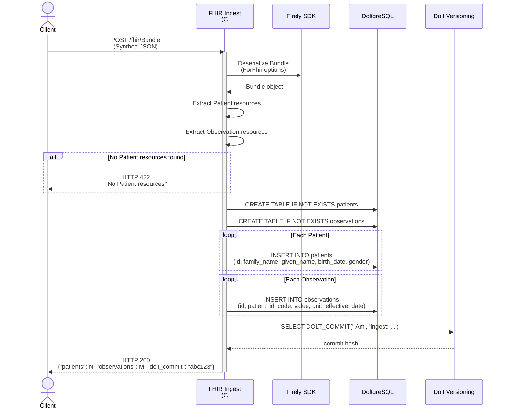

# FHIR Ingest Sequence

Data flow when a Synthea FHIR R4 Bundle is ingested.

```mermaid
sequenceDiagram
    actor Client
    participant FI as FHIR Ingest<br/>(C# / .NET 10)
    participant Firely as Firely SDK
    participant DB as DoltgreSQL
    participant Dolt as Dolt Versioning

    Client->>FI: POST /fhir/Bundle<br/>(Synthea JSON)
    activate FI

    FI->>Firely: Deserialize Bundle<br/>(ForFhir options)
    Firely-->>FI: Bundle object

    FI->>FI: Extract Patient resources
    FI->>FI: Extract Observation resources

    alt No Patient resources found
        FI-->>Client: HTTP 422<br/>"No Patient resources"
    end

    FI->>DB: CREATE TABLE IF NOT EXISTS patients
    FI->>DB: CREATE TABLE IF NOT EXISTS observations

    loop Each Patient
        FI->>DB: INSERT INTO patients<br/>(id, family_name, given_name, birth_date, gender)
    end

    loop Each Observation
        FI->>DB: INSERT INTO observations<br/>(id, patient_id, code, value, unit, effective_date)
    end

    FI->>Dolt: SELECT DOLT_COMMIT('-Am', 'Ingest: ...')
    Dolt-->>FI: commit hash

    FI-->>Client: HTTP 200<br/>{"patients": N, "observations": M, "dolt_commit": "abc123"}
    deactivate FI
```
